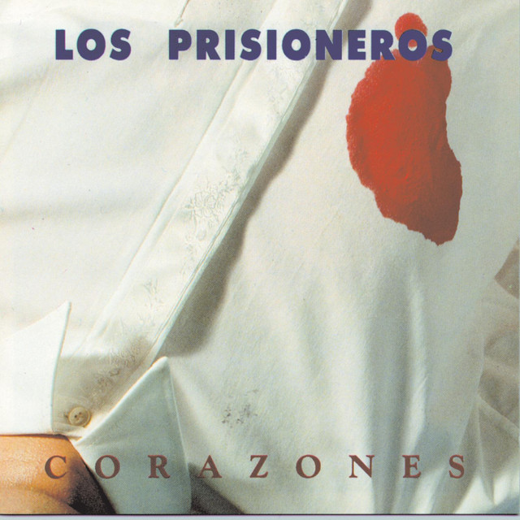

# Solemne-02

## Integrantes del grupo

- Roberto Silva E. [https://github.com/LastAngel16]

## Descripción del disco



- Corazones
- 1990
- Los Prisioneros (Jorge Gonzáles y Miguel Tapia)
- Tracklist:

```txt
1. Tren al Sur
2. Amiga Mía
3. Con suavidad
4.Corazones Rojos
5. Cuentame una historia Original
6. Estrechez de corazón
7. Por amarte
8. Nocher en la ciudad
9. Es demasiado triste
```

- Aspecto del álbum a desarrollar (premisa)

> 

## Conclusión del proceso

- Distancia entre premisa y resultado

> Lorem ipsum blablabla párrafo 1
>
> Lorm ipsum párrafo 2

- Cosas no conseguidas

> Lorem ipsum blablabla

- Descubrimientos al trabajar

> Lorem ipsum blablabla

## Explicación del código (3 aspectos)

### Bloque de código 1

```js
// Tu pedazo de código acá
```

### Bloque de código 2

```js
// Tu pedazo de código acá
```

### Bloque de código 3

```js
// Tu pedazo de código acá
```

### Declaración sobre el uso de IA

- IA utilizada(s) y tipo de licencia (pago, gratuita)

> Chatgpt gratis, Claude pagado, etc

- Problema a resolver a través de la IA

> Generación de grillas, animación de imagen, etc

- Prompts utilizados

> Prompt 1

> Prompt 2

> Prompt 3

- Secciones de código entregadas por la IA

```js
//código entregado por IA acá
```
